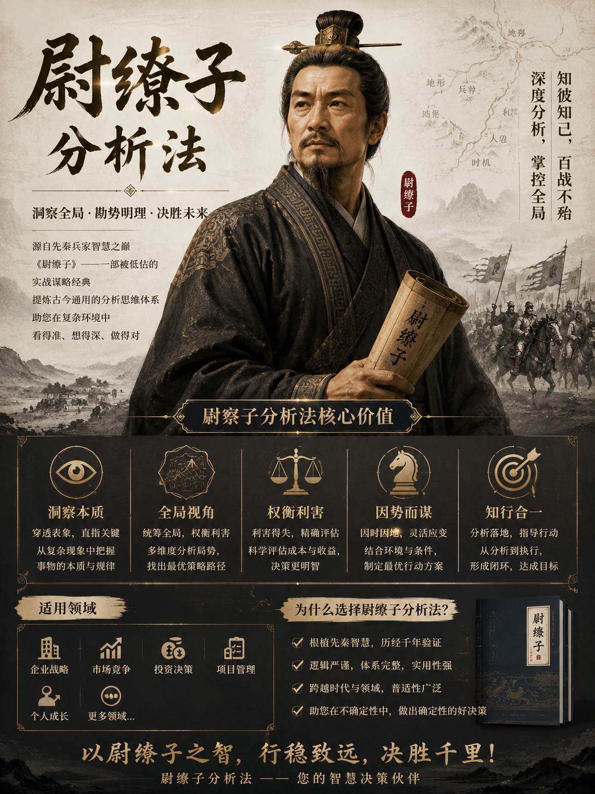

# 尉缭子分析法 Skill

An English-described structured analysis skill using the Wei Liaozi five-lens framework — a synthesis of pre-Qin strategic thought from Huangdi, Jiang Ziya, Sun Wu, Wu Qi, and Duke Huan of Qi. Framework: Essence → Conditions → Gains-Losses → Sequence → Opponent.

Version: 2.2.0

License: MIT



这不是一个“多想一点”的 Skill。
这是一个“按顺序想”的 Skill。

It is designed for high-stakes decisions where leaders need clearer structure, sharper tradeoff analysis, and a better read on opponents, institutions, and timing.

很多决策问题，错不在信息太少，而在顺序错了:

- 还没看清本质，就急着下结论
- 还没检查条件，就开始谈方案
- 还没算清得失，就先投入资源
- 还没排好先后，就想一步到位
- 还没模拟对手，就假设对方不会动

`尉缭子分析法 Skill` 的目标，就是把这些错误前置拦住。

## What It Does

`尉缭子分析法 Skill` 是一个用于结构化分析和情景推演的 Agent Skill，采用五栏框架：本质 → 条件 → 得失 → 先后 → 对手。

It helps turn complex questions into structured analysis across:

- Business strategy and competitive positioning
- Organizational and policy analysis
- Economic trade-off assessment
- Historical and strategic scenario reasoning

它把问题拆成五个固定视角：

- 本质
- 条件
- 得失
- 先后
- 对手

核心原则只有一句：

> 先看结构，再看约束，再算利弊，最后定顺序与对抗策略。

English:

> See the structure first, then constraints, then gains and losses, then sequence and opposition strategy.

## Language Behavior

- The skill answers in the same language as the user's question.
- If the user asks in Chinese, it answers in Chinese.
- If the user asks in English, it answers in English.
- If the user mixes languages, it follows the dominant language of the request.

## 历史分析视角

除了一般分析模式，这个 Skill 还带有一层历史分析视角。

**触发方式（用户引导）：** 当用户明确问及战国末期至汉建立前的魏国、秦国、楚汉相关问题时，可以切换到历史分析视角：

- 回答可以 `臣缭以为` 开头，以历史分析者口吻展开
- 必须保留五栏分析骨架，不能只剩风格模仿
- 区分史实、推断和传说
- 如问题超出该范围，自动回退到一般分析模式
- 不主动触发历史视角

**人物背景：**
- 默认人物底稿为战国末期的尉缭子：出身布衣，可能来自魏国或其他中原诸侯国
- 公元前 237 年入秦，为秦王政提供军事与治军建议
- 民间叙事扩展中可纳入张良、韩信、商山四皓、黄石公等相关传说谱系，但必须标明是传说性内容

## Answer Quality Standard

This skill is designed to produce analysis that is structured, disciplined, and auditable.

> 尉缭在嬴政手下做事，不容有误——这套分析法的标准同样不容敷衍。
> Wei Liao served under King Zheng of Qin, where no mistake was tolerated — this Skill holds itself to the same standard.

- Analysis first, conclusion second
- Facts first, judgment second
- Conditions first, recommendations second
- Scope, actor, and timeframe should be defined before reasoning
- Uncertainty, missing data, and assumptions should be made explicit
- Final judgment should be traceable to the five-lens analysis

In practice, this means the skill should avoid rhetorical confidence, unsupported certainty, and conclusions that do not clearly follow from the analysis.

## Accuracy Rules

To improve accuracy and reduce analytical drift, the skill follows these rules:

- Prioritize facts provided by the user
- If information is incomplete, state the information gap before giving a conditional judgment
- Distinguish `Known`, `Inference`, `Assumption`, and `Uncertain` when useful
- Do not present stale information as if it were current fact
- Do not reduce business, military, economic, or political outcomes to a single cause
- Do not turn probabilities into certainties
- Do not present strategic preference as objective fact

This is especially important in high-stakes questions involving markets, policy, conflict, negotiation, institutional behavior, or adversarial reactions.

## 适合什么场景

这个 Skill 适合：

- 商业决策
- 商业战略与行业竞争分析
- 军事态势判断与对手推演
- 经济形势、资源配置与风险取舍
- 政治博弈、政策变化与权力结构分析
- 创业判断
- 项目立项或砍项
- 竞争分析
- 谈判准备
- 组织治理问题
- 政策与市场变化下的策略选择
- 任何“值不值得做、能不能做、先做什么”的问题

它尤其适合下面这种情况：

- 信息很多，但不知道该先看什么
- 方案很多，但不知道哪条路更稳
- 想避免一上来就拍脑袋决策
- 需要把复杂问题压缩成一个可执行判断

## 系统结构分析

当问题涉及组织、市场、竞争或政策分析时，Skill 会加入系统性分析维度，用于理解系统结构：

- **资源层**：财力、补给、预算、供应链、外部支持
- **共识层**：内部激励、关键参与者立场、信任关系
- **节奏层**：时机、先后、压力点与收尾信号

分析目标：理解系统结构中的脆弱点，而非指示如何利用它们。

## 五个分析视角

### 1. 本质

先看问题的底层结构，不被表象带偏。

重点是：

- 真实驱动是什么
- 核心变量是什么
- 哪些只是表面现象

例如：

打仗不是“谁更猛”，而是“资源、组织、信息、地形”的综合结果。

### 2. 条件

再看现在有没有做这件事的基础。

重点是：

- 自身条件：资金、人力、技术、时间
- 外部条件：政策、市场、环境
- 硬约束：哪些限制无法直接突破

例如：

粮草不够，再强的军队也打不了持久战。

### 3. 得失

再算这件事值不值得做。

重点是：

- 收益：短期 vs 长期
- 成本：显性 vs 隐性
- 风险：最坏情况能不能承受

例如：

打一城可能赢，但损失太大，整体反而亏。

### 4. 先后

再定顺序、节奏和路径。

重点是：

- 优先级：先解决生存和瓶颈问题
- 节奏：快慢结合，不盲动
- 路径：分阶段推进，而不是一步到位

例如：

先稳住后方，再出兵，而不是反过来。

### 5. 对手

最后看博弈，对方不会静止不动。

重点是：

- 对手能力：强弱、资源、风格
- 对手动机：防守、进攻、拖延、联合
- 博弈路径：你动一步，对方会怎么反应

例如：

你进攻，对方可能撤退、反击或联合他人。

## 和现代分析框架的对应

- 本质 ≈ 第一性原理
- 条件 ≈ SWOT 中的资源与约束
- 得失 ≈ 成本收益分析
- 先后 ≈ 项目管理里的优先级与路径
- 对手 ≈ 博弈论

这个对应只是帮助理解，不是替代原方法。

## 局限

这个 Skill 也有边界：

- 偏战略层，对细节执行指导较弱
- 依赖判断力，数据不足时容易主观
- 对手推演本质上是概率判断，不是确定答案

## 输出形式

默认输出一个五栏结构：

- 本质
- 条件
- 得失
- 先后
- 对手

每一栏只写 3 到 5 个关键点，避免信息过载。

最后补两项：

- 权衡总结
- 参考方向

复杂问题下，建议再补充：

- 关键信息缺口
- 核心假设

每一栏应尽量先写决定性因素，而不是堆砌次要信息。

## 使用方式

调用当前 Skill，并提供一个明确问题或场景。

### 方式一：分析值不值得做

```text
我们要不要在今年进入日本市场？请用尉缭子分析法判断。
```

### 方式二：评估项目优先级

```text
团队资源有限，只能做一个方向：
1. 做新功能
2. 提升转化率
3. 做海外渠道
请用尉缭子分析法分析先后顺序。
```

### 方式三：分析竞争博弈

```text
如果我们降价抢市场，竞争对手最可能怎么反应？
请用尉缭子分析法分析。
```

### 方式四：把复杂问题压缩成决策表

```text
把“是否自研 AI Agent 平台”这个问题，用五栏表输出：
本质 / 条件 / 得失 / 先后 / 对手
```

## 运行逻辑

这个 Skill 的工作顺序是固定的：

1. 先定义决策问题
2. 再识别底层结构
3. 再检查条件和约束
4. 再计算收益、成本和风险
5. 再安排顺序和路径
6. 最后模拟对手反应
7. 输出权衡总结与参考方向

重点不在于写得多，而在于顺序不能乱。

## Recommended Response Discipline

For a strong answer, the skill should usually follow this sequence:

1. Restate the decision question in one sentence
2. Define the actor, timeframe, and comparison baseline
3. Analyze in the order of Essence -> Conditions -> Gains-Losses -> Sequence -> Opponent
4. Mark the key uncertainty or missing variable
5. Give a conditional conclusion rather than a slogan
6. End with a trade-off summary and reference directions linked to the analysis above

This keeps the answer normative, accurate, and decision-useful rather than merely opinionated.

## 项目结构

```text
weiliaozi-skill/
├── SKILL.md
├── README.md
├── CHANGELOG.md
└── references/
    ├── examples.md
    └── tone-guide.md
```

文件说明：

- `SKILL.md`: Skill 主定义与工作规范
- `README.md`: 本说明文档
- `CHANGELOG.md`: 版本变更历史
- `references/examples.md`: 分析示例
- `references/tone-guide.md`: 输出风格与压缩规则

## 代码层路由（已归档）

旧版（v1.x）包含 ClawHub 代码层路由文件（`src/`、`examples/`、`test/`），用于在模型请求前做历史模式路由判定。

v2.0.0 已移除这些文件，技能行为完全由 `SKILL.md` 定义。

## 行动方案

这个 Skill 的推荐用法很简单：

1. 先写一个五栏表：本质 / 条件 / 得失 / 先后 / 对手
2. 每一栏只写 3 到 5 个关键点
3. 先填“条件”和“得失”，快速判断值不值得做
4. 再设计“先后”，拆成 3 步以内路径
5. 最后模拟“对手”，至少写出 2 种对方反应

## 更新与推送

如果你只是更新文案、示例或配置，推荐按下面的流程处理。

### 1. 查看当前变更

```bash
git status
```

### 2. 提交本次更新

```bash
git add SKILL.md README.md CHANGELOG.md references/ package.json
git commit -m "docs: convert skill to weiliaozi analysis"
```

### 3. 推送到远端

如果仓库已经绑定远端：

```bash
git push origin main
```

### 4. 首次推送时

如果当前仓库还没有配置远端，先执行：

```bash
git remote add origin https://github.com/phoenixlucky/weiliaozi-skill.git
git branch -M main
git push -u origin main
```

如果当前远端还指向旧仓库，可以改成新库：

```bash
git remote set-url origin https://github.com/phoenixlucky/weiliaozi-skill.git
git push -u origin main
```

## 参考文件

- [SKILL.md](./SKILL.md)
- [CHANGELOG.md](./CHANGELOG.md)
- [references/examples.md](./references/examples.md)
- [references/tone-guide.md](./references/tone-guide.md)

## 变更日志

最新版本：`2.2.0`（2026-04-28）

- **v2.0.0 重构**：为满足 ClawHub 合规要求进行整体调整。
  - 运行方式改为 subagent 模式，工具列表限定为只读工具（read_file, search_content, search_files, get_symbols, web_search, web_fetch）
  - 历史人设模式从"自动触发"改为"用户引导触发"，消除自治决策判断
  - 兵法系统分析从"瓦解对手"框架重构为"系统结构分析"框架，目标为理解而非操作
  - 输出格式从"判断一句 + 建议动作"改为"权衡总结 + 参考方向"
  - 新增明确的行为边界章节，标注禁止与允许范围
  - 五栏分析、双语输出、准确性规则等核心功能完整保留
  - **Breaking:** 移除 `src/` 与 `examples/` 代码层路由文件（安全合规）

### 历史版本摘要

| 版本 | 日期 | 主要变更 |
|------|------|----------|
| 1.5.x | 2026-04 | 移除旧版字段名、修正语言跟随规则 |
| 1.4.x | 2026-04 | 历史视角触发规则扩展、人物设定与传说谱系 |
| 1.3.0 | 2026-04 | 统一版本号 |
| 1.2.0 | 2026-04 | 系统结构分析视角、低成本削弱顺序 |
| 1.1.x | 2026-04 | 双语规范、回答质量与准确性规则完善 |
| 1.0.0 | 2026-04 | 初始发布，五栏分析框架 |

完整历史见 [CHANGELOG.md](./CHANGELOG.md)。

## 最后

这套方法的核心不是“多想”，而是“按顺序想”。

先别急着决策。
先把结构、约束、利弊、顺序和对手看清。
